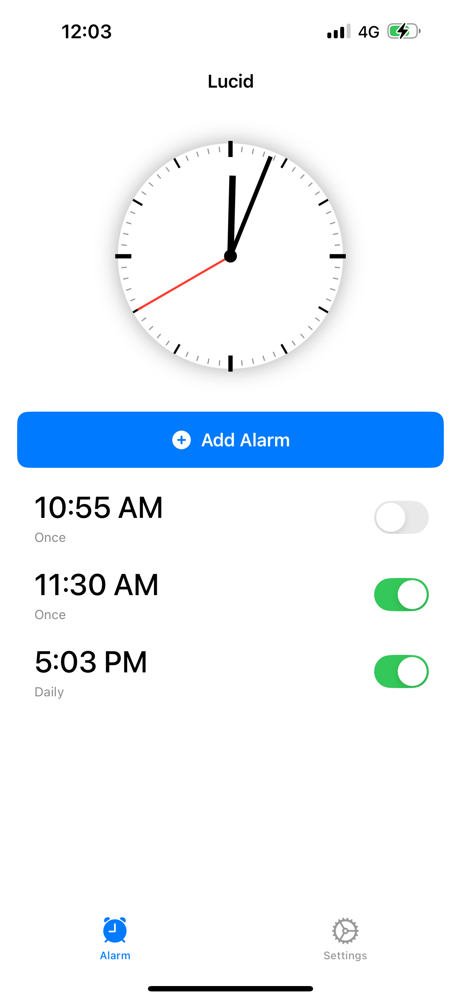

# Lucid

Lucid is an iOS app designed to ensure you truly wake up by requiring you to answer questions correctly before disabling the alarm. Perfect for heavy sleepers or those who tend to snooze their alarms without fully waking up.


## App Screenshots



## Features

- **Elegant Analog Clock Display**: Classic design with hour, minute, and second hands
- **Multiple Question Types**: Answer challenging questions to disable the alarm:
  - Simple Math with a Twist
  - Word Scrambles
  - Reading Comprehension
  - Verbal Math
- **Flexible Alarm Settings**:
  - One-time alarms
  - Recurring alarms (daily, weekdays, weekends, or custom days)
  - Custom sound selection
- **Emergency Override**: Hidden setting for when you absolutely need to silence the alarm quickly
- **Sample Question Preview**: Test yourself with sample questions before setting the alarm
- **Clean, Minimal UI**: Intuitive design that follows iOS Human Interface Guidelines

## Technical Details

### Architecture & Design

Lucid is built using:
- Swift and SwiftUI for the user interface
- MVVM (Model-View-ViewModel) architecture for clean separation of concerns
- UserDefaults for persistent storage of alarm settings
- Local notifications for alarm functionality
- System sounds for alarm audio

The app follows a modular design with:
- **Models**: Data structures for alarms and questions
- **Views**: SwiftUI components for the user interface
- **ViewModels**: Business logic connecting models and views
- **Managers**: Service classes for specific functionality (alarms, sounds, questions)

### Core Components

- **AlarmManager**: Handles scheduling, triggering, and managing alarms
- **QuestionGenerator**: Creates and validates different types of questions
- **SoundManager**: Manages alarm sound selection and playback

## Installation

### Requirements
- iOS 15.0 or later
- Xcode 13 or later
- Swift 5.5 or later

### Getting Started

1. Clone this repository:
   ```bash
   git clone https://github.com/yourusername/lucid-alarm.git
   ```

2. Open the project in Xcode:
   ```bash
   cd lucid-alarm
   open Lucid.xcodeproj
   ```

3. Build and run the application using the Xcode simulator or a physical device

## Usage Guide

### Setting an Alarm

1. Open the Lucid app
2. Tap the "Add Alarm" button
3. Set your desired time using the time picker
4. Choose repeat options (Once, Daily, Weekdays, Weekends, or Custom)
5. Select your preferred alarm sound
6. Choose which question types you want to answer
7. Optionally enable the emergency override
8. Tap "Save Alarm"

### When the Alarm Triggers

1. The alarm will sound and display a question
2. Enter your answer in the text field
3. Tap "Submit Answer"
4. If your answer is correct, the alarm will stop
5. If your answer is incorrect, a new question will appear and the alarm will continue

## Future Development

Potential features for future versions:
- More question types to keep your brain engaged
- Custom themes and appearance settings
- Alarm history tracking
- Cloud synchronization across multiple devices
- Voice recognition for spoken answers
- Integration with sleep tracking

## Acknowledgments

- System sounds from Apple's iOS sound library
- Built with SwiftUI and modern iOS development practices

---

Developed by Arfath Ahmed Syed © 2025